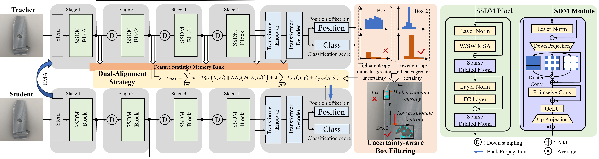
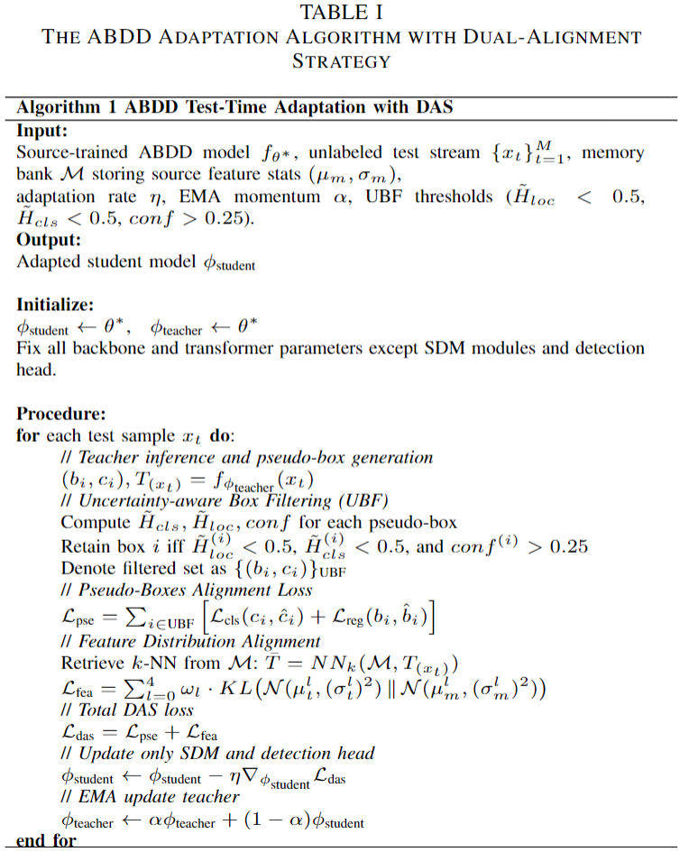

# 🛠️ ABDD: Aero-engine Blade Defect Detector with Dual-Alignment Test-Time Adaptation

[](https://www.python.org/)
[](https://pytorch.org/)
[](LICENSE)

**ABDD** is a robust, end-to-end defect detection framework designed for **aero-engine blade inspection under dynamic domain shifts** (e.g., lighting changes, background variations, defect morphology drift). Built upon DETR architecture, ABDD introduces three key innovations for reliable test-time adaptation:

- 🔁 **Dual-Alignment Strategy (DAS)**: Simultaneously aligns pseudo-boxes (instance-level) and multi-scale feature distributions (domain-level).
- 🧠 **Uncertainty-Aware Box Filtering (UBF)**: Filters unreliable pseudo-labels using normalized classification/localization entropy and confidence.
- ⚡ **Sparse Dilated Mona (SDM)**: A lightweight, parameter-efficient module enabling fast adaptation while preserving source knowledge.

Unlike conventional detectors requiring retraining or post-processing (e.g., NMS), ABDD adapts **online** to unlabeled test streams with minimal computation—ideal for real-world industrial deployment.

---

## 🖼️ Architecture Overview



*Figure 1: Overall architecture of ABDD, featuring the SSDM backbone, dual-alignment strategy (DAS), and uncertainty-aware box filtering (UBF).*

---


*Figure 2: Pseudocode of the ABDD test-time adaptation algorithm with Dual-Alignment Strategy (DAS).*

---
## ✨ Key Features
- **No NMS needed**: End-to-end detection via DETR-style architecture.
- **Test-time only adaptation**: No access to source data during deployment.
- **Parameter-efficient**: Only SDM modules + detection head are updated (<5% of total parameters).
- **Robust to distribution shift**: Handles both global (background, illumination) and local (defect shape) domain changes.

---

## 📦 Quick Start
```bash
git clone https://github.com/wangzhaoyang-508/ABDD.git
cd ABDD
pip install -r requirements.txt

# Run inference with pre-trained model
python demo.py --input ./samples/blade.jpg --output ./results/

# Enable online adaptation on unlabeled stream
python adapt.py --stream ./test_stream/ --source-stats ./assets/source_stats.pkl
```

## 📊 Dataset Access

The **AeB-Defect** dataset contains high-resolution images of aero-engine blades with annotated surface defects under diverse imaging conditions. Due to confidentiality and industrial sensitivity, the dataset is **available upon request**.

To request access, please fill out the application form below:

- [Apply for Dataset Access](https://forms.gle/wspYc9rvwiwR41F99)

> **Note**: Please allow 3–5 business days for review. Approved applicants will receive download instructions via email.

## 📚 Citation

If you find ABDD useful in your research or application, please cite our work:

```bibtex
@article{abdd2026,
  title={ABDD: Aero-engine Blade Defect Detector with Dual-Alignment Test-Time Adaptation},
  author={Zhaoyang Wang, Haiyong Chen, Yining Wang, Binyi Su, ATIK SHAHARIAR},
  journal={IEEE Transactions on Circuits and Systems for Video Technology},
  year={2026}
}
```
## Acknowledgment
Our dataset is bulit upon [AeBAD](https://github.com/zhangzilongc/MMR).
